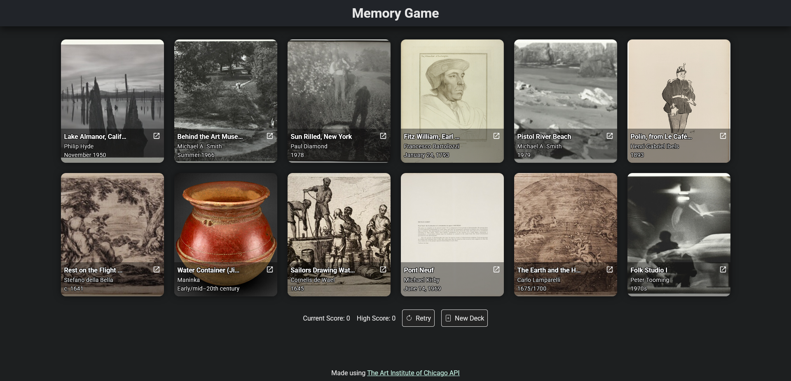

# Memory Card Game

A memory card game built with React that challenges players to click on different cards without repeating any selection. This project demonstrates core React concepts such as functional components, hooks (useState and useEffect), API integration, and state management. Created as part of The Odin Project's React curriculum.

## How to Play

-   Click on any card to start the game
-   Remember which cards you've already clicked
-   Try to click on different cards each time
-   Your score increases with each new card you click
-   If you click the same card twice, the game resets

## Technologies Used

-   React
-   HTML CSS
-   Vite
-   The Art Institute of Chicago API

## Live Demo

You can check out the live demo of the project here: [Live Demo](https://memory-game-emre.netlify.app/)

## Screenshot

